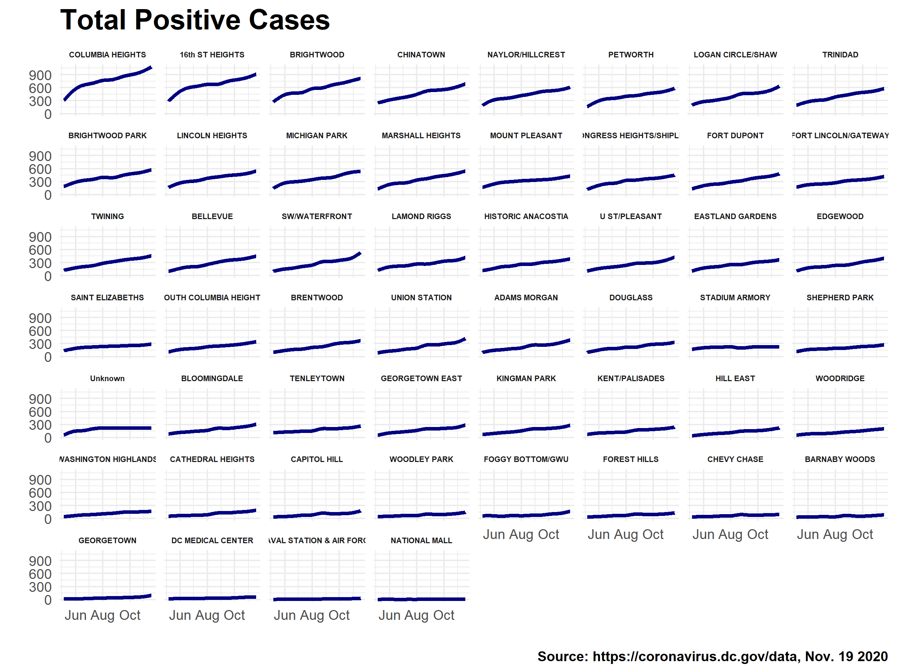
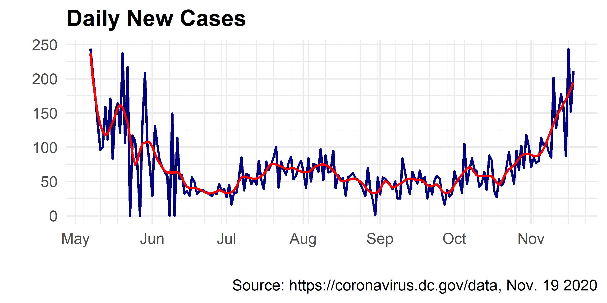

```{r setup, include=FALSE}
knitr::opts_chunk$set(echo = TRUE, warning = FALSE)
library(knitr)
library(tidyverse)
library(mgcv)
library(geojsonsf)
library(sf)
library(gganimate)
```


## Overview

During the ongoing coronavirus pandemic, the District of Columbia Department of Health (DC Health) has been collecting and publishing data on the spread of COVID-19 in DC. Among other [data](https://coronavirus.dc.gov/data) across the District and Wards, DC Health also provides statistics on the coronavirus across its Health Planning Neighborhoods (HPNs). While DC does not have official neighborhood boundaries, HPNs roughly follow census tract lines defined by the US Census Bureau and are used by DC Health for analysis and service delivery.

The two most ostensible pieces of coronavirus-related data DC Health provides at the HPN level are: **Total Positive Reported Cases** and the **Total Number of Tests**. These metrics are released on a daily basis via the [COVID-19 Surveillance webpage](https://coronavirus.dc.gov/data). While these are preliminary numbers, subject to change in further reports, they do provide information at trends occurring at the neighborhood level. The goal of this post is to explore these trends. 

This post will be structured as follows:

[**Visualizing Total Positives**](#visualizing-total-positives)  
[**Visualizing Daily Cases **](#visualizing-daily-cases)  

## Visualizing Total Positives

While the DC OpenData Portal seems to have data on [COVID-19 Total Positive Cases by Neighborhood](https://opendata.dc.gov/datasets/dc-covid-19-total-positive-cases-by-neighborhood), it is out of date, as of the publishing of this post. Instead, DC is publishing Excel sheets daily via the [COVID-19 Surveillance webpage](https://coronavirus.dc.gov/data). The file with the relevant sheet is available here. Below, I retrieve and load in the relevant file. 

```{r}
# Download surveillance data
url <- "https://dcgov.app.box.com/index.php?rm=box_download_shared_file&vanity_name=DCHealthStatisticsData&file_id=f_645422184765"
dest <- paste0("data/covid_",Sys.Date(),".xlsx")
#download.file(url, dest , mode = "wb")
cases <- readxl::read_excel(dest, sheet = "Total Positives by Neighborhood")
cases %>% head %>% kable
```

I then clean this data so that the HPN `CODE` and `DC_HPN_NAME` are separate columns while making sure that the data covers all dates from the start of the reporting to the end. I fill forward values if there are any missing days and add an index measuring the time parameter (`ORDER`).  

```{r}
cases_cl <- cases %>%
  mutate(CODE = str_extract(Neighborhood, "N\\d+"),
         DC_HPN_NAME = str_extract(Neighborhood, "(?<=\\: ).*"),
         DATE = as.Date(Date),
         CODE = if_else(CODE == "N35", "N0", CODE),
         CODE = if_else(is.na(CODE), "Unknown", CODE),
         DC_HPN_NAME = if_else(is.na(DC_HPN_NAME), "Unknown", DC_HPN_NAME),
         DC_HPN_NAME = if_else(DC_HPN_NAME == "GWU", "FOGGY BOTTOM/GWU", DC_HPN_NAME)) %>%
  distinct(CODE, DC_HPN_NAME, DATE, TOTAL_POSITIVES = `Total Positives`)

cases_comb <- expand.grid(CODE = unique(cases_cl$CODE),
                          DATE = seq(min(cases_cl$DATE),max(cases_cl$DATE), by = "days")) %>%
  distinct(.keep_all = T) %>%
  left_join(cases_cl, by = c("CODE","DATE")) %>%
  arrange(CODE, DATE) %>%
  fill(DC_HPN_NAME, .direction = "updown") %>%
  group_by(CODE) %>%
  fill(TOTAL_POSITIVES, .direction = "updown") %>%
  ungroup %>%
  mutate(TOTAL_POSITIVES = replace_na(TOTAL_POSITIVES, 0),
         WEEK = lubridate::week(DATE),
         WEEK = (WEEK - min(WEEK)) + 1 ,
         DATE_FORMAT = format(DATE, "%b %d"),
         DATE_FORMAT = if_else(CODE == "N0", DATE_FORMAT, NA_character_),
         ORDER = as.numeric((DATE - min(DATE)) + 1)) %>%
  select(CODE, DC_HPN_NAME, DATE, DATE_FORMAT, TOTAL_POSITIVES, ORDER)

cases_comb %>% head %>% kable
```

Furthermore, I fit a Generalized Additive Model to the data. This will be used to ensure that values in the animated map transition between days more seamlessly. This is stored in the `EST` column. 

```{r, fig.align='center', dpi=320, fig.width=10, fig.height=7}
cases_comb_est <- cases_comb %>%
  nest(data = -CODE) %>% 
  mutate(EST = map(data, ~round(gam(TOTAL_POSITIVES ~ s(ORDER, bs = "cs"), data = .x)$fitted.values, 0))) %>% 
  unnest(cols = c(data, EST)) %>%
  mutate(EST = if_else(EST < 0, 0, EST))
```



Additionally, geographies for each HPN are published via DC's OpenData Portal. I read the file in below and assign it centroids for each HPN.  

```{r}
# Health Planning Neighborhoods geographies
url <- "https://opendata.arcgis.com/datasets/de63a68eb7674548ae0ac01867123f7e_13.geojson"
hpn <- geojsonsf::geojson_sf(url)

# Calculate centers of HPNs 
hpn_cent <- hpn %>% 
  bind_cols(as_tibble(st_coordinates(st_centroid(hpn$geometry)))) 

```

Once the data is joined to the geographies, I plot it on the map using the following code:

```{r}
# Mapping
cases_hpn <- left_join(hpn_cent,cases_comb_est, by = "CODE")

map <- cases_hpn %>%
  #filter(ORDER == 20) %>%
  ggplot(aes(fill = EST)) + 
  geom_sf(color = "white")+
  coord_sf(crs = 4326, datum = NA, clip = "off") +
  scale_fill_gradient(low = "white", high = "red", na.value="grey80",
    labels = scales::comma_format(accuracy = 1)) +
  geom_text(aes(label = round(TOTAL_POSITIVES,0), x = X, y = Y), size = 2.75, fontface = "bold") +
  geom_text(aes(label = DATE_FORMAT), x = -76.9, y = 38.97, fontface = "bold", size = 6) +
  theme_void()+
  theme(legend.position = "none", plot.title = element_text(face = "bold", size = 16, hjust = .5)) +
  labs(title="Total Reported COVID-19 Positive Cases") +
  transition_time(ORDER) 
```


## Visualizing Daily Cases 

New cases can be calculated by subtracting the previous day's total positive cases from the current day: $$N_t = C_t - C_{t-1}$$ This is done with the data below. 

```{r}
# Calculate New Daily Cases
cases_comb_mar <- cases_comb_est %>% 
  group_by(CODE) %>%
  mutate(MARGINAL_POSITIVES = TOTAL_POSITIVES - lag(TOTAL_POSITIVES),
         #Remove anomalies in the data
         MARGINAL_POSITIVES = if_else(MARGINAL_POSITIVES < 0, 0 , MARGINAL_POSITIVES),
         MARGINAL_POSITIVES = if_else(MARGINAL_POSITIVES > 30, lag(MARGINAL_POSITIVES) , MARGINAL_POSITIVES)) %>%
  filter(!is.na(MARGINAL_POSITIVES))

# LOESS Smooth New Cases for Mapping
cases_comb_mar_est <- cases_comb_mar %>%
  nest(data = -CODE) %>% 
  mutate(EST_MAR = map(data, ~round(loess(MARGINAL_POSITIVES ~ ORDER, data=.x, span=0.08)$fitted, 2))) %>% 
  unnest(cols = c(data, EST_MAR)) %>%
  mutate(EST_MAR = if_else(EST_MAR < 0, 0, EST_MAR))
```

 


Next, I join with geographic HPN data. Similar to above, this provides a geospatial dataset of new COVID-19 positive cases, which is then plotted here. 

```{r}
# Join Geographic Data
cases_hpn_mar <- left_join(hpn_cent,cases_comb_mar_est, by = "CODE")


map_mar <- cases_hpn_mar %>%
  ggplot(aes(fill = EST_MAR)) + 
  geom_sf(color = "white")+
  coord_sf(crs = 4326, datum = NA, clip = "off") +
  scale_fill_gradient(low = "white", high = "red", na.value="grey80",
                      labels = scales::comma_format(accuracy = 1)) +
  geom_text(aes(label = DATE_FORMAT), x = -76.9, y = 38.97, fontface = "bold", size = 6) +
  theme_void()+
  theme(legend.position = "none", plot.title = element_text(face = "bold", size = 16, hjust = .5)) +
  labs(title="New COVID-19 Positive Cases per Day", 
       caption = "Source: https://coronavirus.dc.gov/data, Nov. 19 2020") +
  transition_time(ORDER) 
```


The data here can be used to model the spread of outbreaks. While this post simply explored the data, the following post will be an effort to produce spatial-temporal model of the COVID-19 spread in DC. 