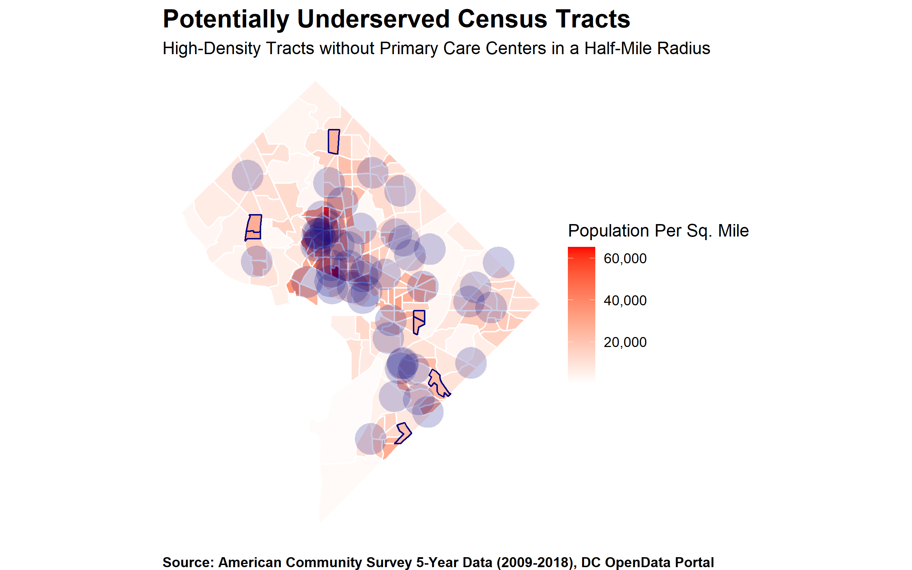
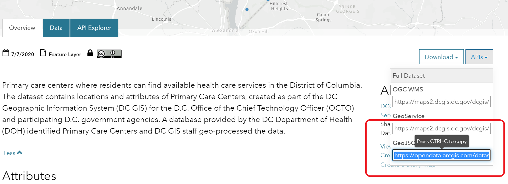
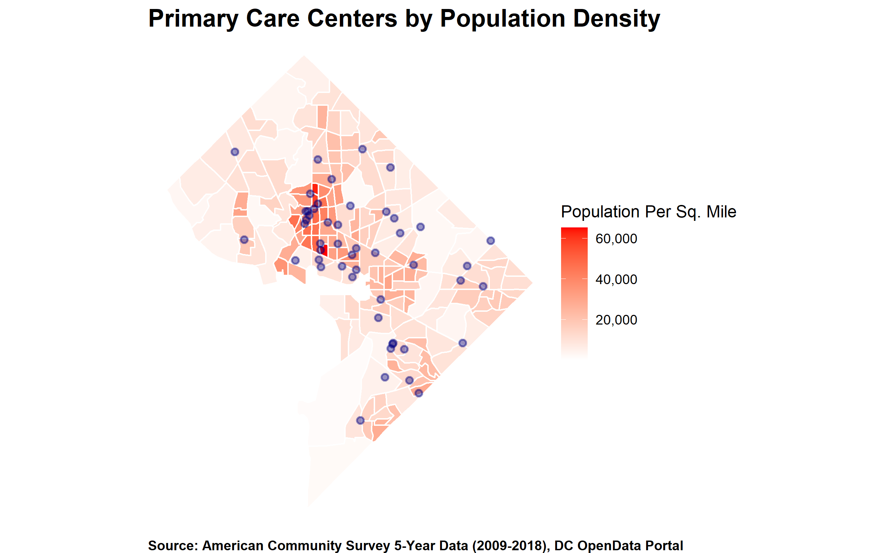
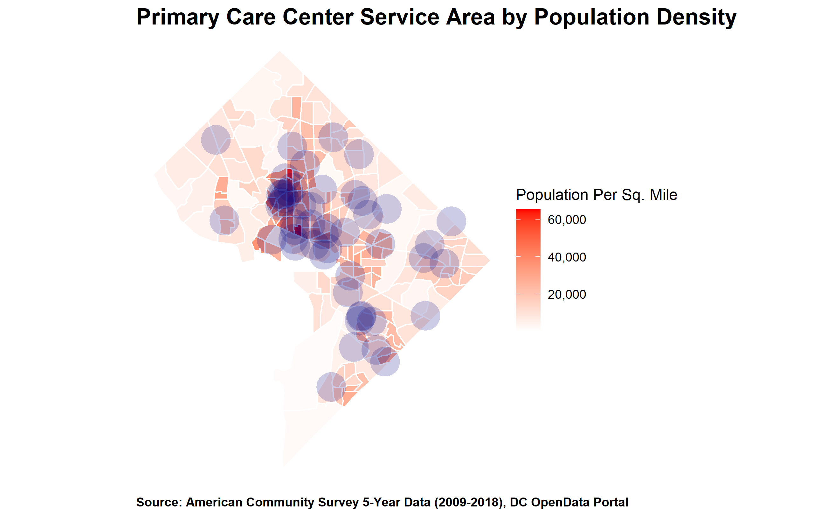
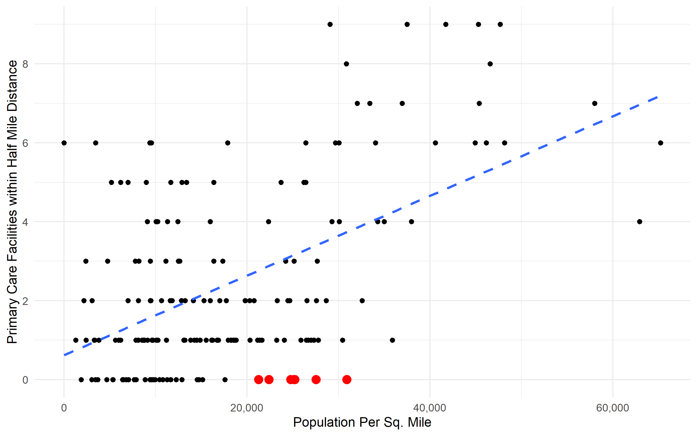

```{r setup, include=FALSE}
knitr::opts_chunk$set(echo = TRUE, warning = FALSE, message = FALSE)
library(knitr)
library(tidyverse)
library(geojsonsf)
library(sf)
```



## Overview

The District of Columbia government publishes data available for public use via its [OpenData DC](https://opendata.dc.gov/) portal. The OpenData DC portal is a white-labeled ArcGIS Site, where the Office of the Chief Technology Officer curates datasets, often geographic data, relating to services the District provides.

This post is the first part of what will be an ongoing series of blog posts, where I explore a dataset made available via the OpenData DC portal. I analyze the data using the statistical programming language R, as a way to demonstrate its capabilities and provide examples for R users who may want to replicate the analysis.  

Here, I examine data provided by the DC Department of Health (DC Health), regarding the location of primary care centers throughout the District. The [Primary Care Centers](https://opendata.dc.gov/datasets/primary-care-centers-2) dataset contains the geometries, or geographic locations, of each primary care center. This data is then matched to the population density of the Census Tract (from the [2018 American Community Survey](https://www.census.gov/data/developers/data-sets/acs-5year.html)) in the area which the primary care center serves. Finally, I examine whether there are areas of greater population density which may be underserved as a consequence of their distance from primary care centers. 

## Downloading and Cleaning the Data

The first step here is to pull in the data using the GeoJSON API available via the link on the dataset page.



Using the link provided in the GeoJSON box, I read it into R using the `geojson_sf()` function. I then plot it using the `ggplot` package.

```{r}
library(tidyverse)
library(geojsonsf)
library(sf)

# Point to the link
pc_centers_url <- "https://opendata.arcgis.com/datasets/018890d7399245759f05c7932261ef44_7.geojson"

# Download and read in the data
pc_centers <- geojsonsf::geojson_sf(pc_centers_url)

# See what this gives us
pc_centers %>% 
  ggplot() +
  geom_sf() 
```

This plot shows us the locations of all the primary care centers in DC. However, I want to take this a step further and examine how well-positioned each primary care center is to populated areas. 

I can do this by loading data from the Census regarding the population density (as measured by population per square mile) of each [Census Tract](https://www.census.gov/programs-surveys/geography/about/glossary.html#par_textimage_13).

```{r, eval=FALSE}
library(tidycensus)

#Get Census data and map
pop <- tidycensus::get_acs(geography = "tract", 
                           state = 11, 
                           county = 001, 
                           year = 2018, 
                           survey = "acs5", 
                           variables = "B01001_001",
                           geometry = T,
                           output = "tidy", )

pop_cl <- pop %>% 
  sf::st_transform(crs = 3559) %>% #this sets the projection we're using
  mutate(area = sf::st_area(geometry) %>% units::set_units(mi^2), #calcuate area
         density = as.numeric(estimate/area)) #divide area by population

# Create population density map
pc_density_map <- pop_cl %>% 
  ggplot(aes(fill = density)) +
  geom_sf(color = "white") +
  # Include primary health center data
  geom_sf(data = pc_centers, inherit.aes = F, 
          color = "navy", stroke = 1, fill = "navy", alpha = .4) +
  # Add color representing population density
  scale_fill_gradient(low = "white", high = "red", 
                      labels = scales::comma_format(accuracy = 1)) +
  labs(title = "Primary Care Centers by Population Density",
       fill = "Population Per Sq. Mile",
       caption = "Source: American Community Survey 5-Year Data (2009-2018), DC OpenData Portal") +
  theme_void() +
  theme(plot.title = element_text(face = "bold", size = 16, hjust = .5),
        plot.caption = element_text(face = "bold", hjust = .5))

```
 

This graph shows the population density of DC, calculated via the American Community Survey from the Census. The points overlaid show the location of each primary care health center. There are certain Census Tracts that have a fairly dense population, but are further away from primary care centers. Conversely, there are primary care centers further away from dense Census Tracts. Ideally, we would want a the number of primary care centers to be proportional to the population density in a given area. 

## Analysis

In order to explore whether some areas may be underserved I assume that each primary care center has an geographic area that it serves. Here, each primary care center is assumed to receive most of its patients from within a 0.5 mile radius ('Service Area'). This may create an unusually narrow boundary, particuarly given that I am not factoring differences in the distances people may walk, drive, or take public transportation to, that would otherwise expand or contract a primary care center's Service Area.

With these assumptions in mind, I map the number of primary care centers' Service Areas that overlap with each Census Tract here. 

```{r, eval=F}
# Mapping Service Area

pc_area_map <- pop_cl %>% 
  ggplot() +
  geom_sf(color = "white", aes(fill = density)) +
  # Calculate service areas
  geom_sf(data = pc_centers %>% sf::st_transform(crs = 3559)  %>% st_buffer(dist = 800) , inherit.aes = F, color = NA, fill = "navy", alpha = .2) +
  scale_fill_gradient(low = "white", high = "red", na.value="grey80",
                      labels = scales::comma_format(accuracy = 1)) +
  labs(title = "Primary Care Center Service Area by Population Density",
       fill = "Population Per Sq. Mile",
       caption = "Source: American Community Survey 5-Year Data (2009-2018), DC OpenData Portal") +
  theme_void() +
  theme(plot.title = element_text(face = "bold", size = 16, hjust = 0),
        plot.caption = element_text(face = "bold", hjust = 0))
```
 
The map above shows generally good coverage in the most population-dense Census Tracts. However there are a few tracts with a moderately large population density, that have no primary care centers within the Service Area defined here. 

In order to identify these, I first plot them on a graph showing each tract's population density and the number of primary care centers within the specified Service Area. 

```{r, eval=F}
# Find intersections between Tracts and Service Area
intersection <- st_intersects(pop_cl %>% select(GEOID,density), 
                      pc_centers %>% 
                        st_buffer(dist = 800) %>%
                        select(GEOID, PrimaryCarePtNAME))

# Count the number of primary care centers within tracts
dens <- pop_cl %>% 
  select(GEOID,density) %>%
  sf::st_drop_geometry() %>%
  mutate(count = map(intersection, length) %>% unlist) %>%
  arrange(desc(density))

# Plot this 
pop_dens <- dens %>% 
  ggplot(aes(density, count)) +
  geom_point() +
  geom_point(data=dens %>% filter(count == 0 & density > 20000),size=3,color="red") +
  geom_smooth(method = "lm", se = F, lty = 2) +
  theme_minimal() +
  labs(x = "Population Per Sq. Mile", 
       y = "Primary Care Facilities within Half Mile Distance") +
  scale_x_continuous(labels = scales::comma_format()) +
  scale_y_continuous(breaks = seq(0,10,2))
```
  

The tracts with sizable population density (20,000+ PPSM) that have no primary service centers within a half-mile radius are identified in red. There are six of them identified on the graph here.

Lastly, I identify them on the original map here:

```{r, eval=F}
# Identify underserved areas
underserved <- dens %>% filter(count == 0 & density > 20000)

# Outline areas on original map
tracts_underserved <- pop_cl %>% 
  mutate(underserved = GEOID %in% underserved$GEOID) %>%
  ggplot() +
  geom_sf(aes(fill = density, color = underserved), stroke = 2) +
  geom_sf(data = pc_centers %>% sf::st_transform(crs = 3559)  %>% st_buffer(dist = 800), 
          inherit.aes = F, color = NA, fill = "navy", alpha = .2) +
  scale_color_manual(values = c("white","navy"), guide = F) +
  scale_fill_gradient(low = "white", high = "red", na.value="grey80",
                      labels = scales::comma_format(accuracy = 1)) +
  labs(title = "Underserved Census Tracts",
       subtitle = "High-Density Tracts without Primary Care Centers in Half-Mile Radius",
       fill = "Population Per Sq. Mile",
       caption = "Source: American Community Survey 5-Year Data (2009-2018), DC OpenData Portal") +
  theme_void() +
  theme(plot.title = element_text(face = "bold", size = 16, hjust = 0),
        plot.caption = element_text(face = "bold", hjust = 0))
```


The areas identified with a blue outline are those that could, under the assumptions noted here, but underserved, when it comes to having primary care centers within a half-mile radius. 

## Discussion
As noted here, this is only a preliminary analysis. Further analyses may seek to determine the average distance between each primary care center and resident. This kind of analysis would require resident addresses and information about how each resident commutes. 

A simpler method may be to adjust the Service Area radius by the proportion of residents in each tract reporting using different methods of transportation, which is available as a Census variable. 

Additionally, the size of each primary care center and whether or not it is available to everyone in the public or select individuals would also determine whether or not residents are generally well-served by the centers closest to them.  


