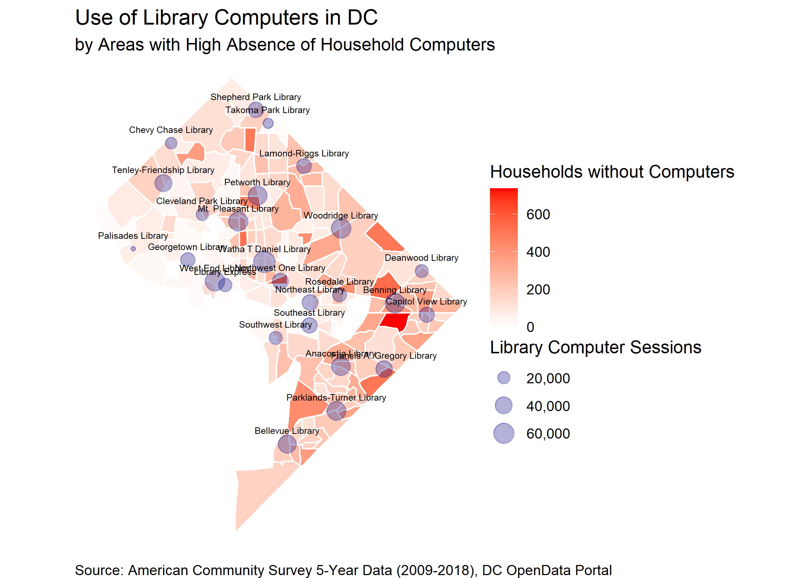
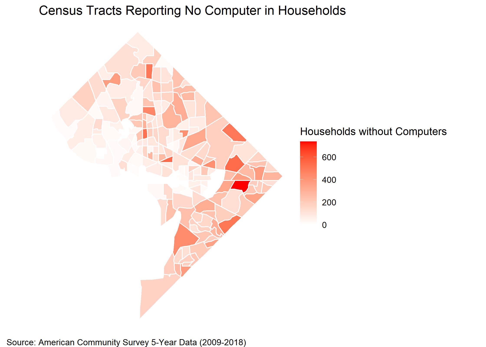
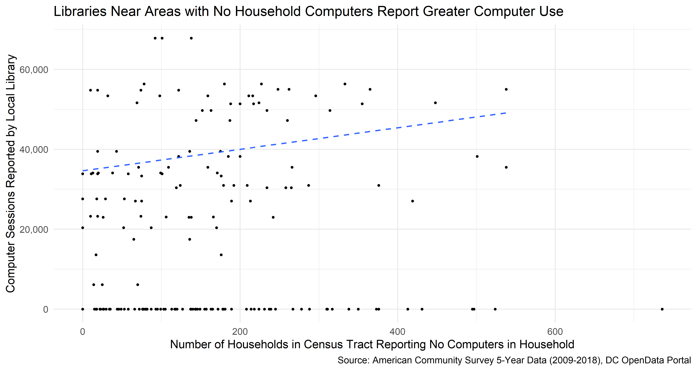
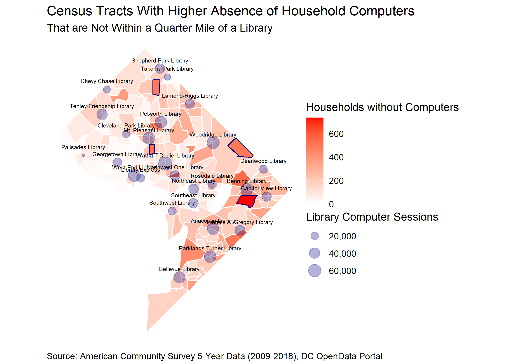

```{r setup, include=FALSE}
knitr::opts_chunk$set(echo = TRUE, warning = FALSE, message = FALSE)
library(knitr)
library(tidyverse)
library(geojsonsf)
library(sf)

usage <- read_rds("output/usage.rds")
```



## Overview

The DC Public Library (DCPL) system ensures residents have access to basic technology services by providing computers and internet access at various locations throughout the District. DCPL [publishes data](https://opendata.dc.gov/datasets/library-resource-usage/data) of the use of these services on a yearly basis. 

Here, I examine the relationship between the use of public technology services and the absence of technology throughout the district. In particular, I look at whether areas that report the absence of computers or internet access have increased usage of these services at DC Public Library (DCPL) locations.

*This is the second part of an ongoing series of posts using [DC's OpenData portal](https://opendata.dc.gov/) for analyzing data using R [(See part one here)](https://hershgupta.com/2020/11/30/dc-opendata-part-1/). *

## Downloading and Cleaning the Data

The DC OpenData portal publishes data on DCPL use by library branch and the locations of each library separately. I download the data, filter to fiscal year 2019, and merge these two datasets with the following code:

```{r, eval=F}
# Load packages for analysis
library(tidyverse)
library(geojsonsf)
library(sf)

# Get library usage data and geometry 
usage <- geojsonsf::geojson_sf("https://opendata.arcgis.com/datasets/f088a09f8bd04aba8cd6b5b344ae9bb3_56.geojson") %>% 
  sf::st_drop_geometry() %>% # Remove unnecessary columns
  filter(FISCAL_YEAR == 2019) # Filter to FY19

# Get library locations 
libraries <-  geojson_sf("https://opendata.arcgis.com/datasets/cab0eaaad4e242c18a36422c3323e6ac_4.geojson") %>%
  left_join(usage, by = "GIS_ID") %>% # Join to usage  data
  sf::st_transform(crs = 3559)  # Use the correct map projection
```

This gives us the following data, with the locations of each library:

```{r, echo=F}
kable(head(usage))
```

Next we want to add data regarding the presence of technology services within households in DC. The best place to retreive this information is via the US Census' American Community Survey (ACS). R makes it easy to download this data, along with the geographic boundaries of Census Tracts in DC:

```{r, eval=F}
library(tidycensus)

# Get Census estimates for "No Computer"
comp <- tidycensus::get_acs(geography = "tract", 
                           state = 11, 
                           county = 001, 
                           year = 2018, 
                           survey = "acs5", 
                           variables = c("B28001_011E", # No Computer in Household
                                          "B28002_013E") # No Internet Access
                           geometry = T, output = "wide")

# Use the correct map projection for census tracts
comp_geo <- comp %>% 
  sf::st_transform(crs = 3559)
```



This map shows Census Tracts that have high rates of households responding "No Computer" when asked whether they have a computer in the house. 

## Analysis

I join the data from DC's OpenData portal with the data from the American Community Survey. This will allow me to examine whether areas of DC that report higher absence of computers in the household are also near public libraries that report higher computer usage. 

Note, I use 400 meters, which is roughly a quarter-mile, as that can be loosely defined as walking distance between DC neighborhoods. 

```{r, eval=F}
# Join data
joined <- st_join(comp_geo, libraries%>% 
                    st_buffer(dist = 400)) %>%
  replace_na(list(COMPUTER_SESSIONS = 0)) %>%
  rename(NO_COMPUTER = B28001_011E,
         NO_INTERNET = B28002_013E)

# Plot relationship
joined %>%
  ggplot(aes(NO_COMPUTER, COMPUTER_SESSIONS)) +
  geom_point() +
  geom_smooth(method = "lm", se = F, lty = 2) + 
  scale_y_continuous(labels = scales::comma_format()) +
  labs(x = "Number of Households in Census Tract Reporting No Computers in Household", 
       y = "Computer Sessions Reported by Local Library",
       titles = "Libraries Near Areas with No Household Computers Report Greater Computer Use",
       caption = "Source: American Community Survey 5-Year Data (2009-2018), DC OpenData Portal") +
  theme_minimal(base_size = 18)
```



The data shows a positive relationship between the number of households in a Census Tract reporting not having a computer and the number of computer sessions at the nearby library. This is a significant relationship at the $\alpha = .05$ level, with the lack of computers in the household explaining approximately 25% of the variation in computer sessions alone. The results also indicated that for every additional household without a computer, there was, on average, an increase of 15 to 37 computer sessions at the nearby library, over the course of a year. 

## Discussion

There is, however, variation in this trend. Specifically, there is geographic variation in this data. As noted above, there are areas in DC with a high concentration of households without computers. Plotting this data on a map may help reveal areas in which there are high numbers of households without computers.

```{r, eval=F}
joined %>%
  ggplot() +
  geom_sf(aes(fill = NO_COMPUTER), color = "white") +
  geom_sf(data = libraries %>% filter(COMPUTER_SESSIONS > 0), 
          aes(size = COMPUTER_SESSIONS),
          inherit.aes = F, color = "navy", alpha = .3) +
  geom_sf_text(data = libraries %>% filter(COMPUTER_SESSIONS > 0), 
               aes(label = NAME.x), size = 2, vjust = -1.5) +
  scale_fill_gradient(low = "white", high = "red", na.value="grey80",
                      labels = scales::comma_format(accuracy = 1)) +
  scale_size_continuous(labels = scales::comma_format()) +
  labs(title = "Use of Library Computers in DC",
       subtitle = "by Areas with High Absence of Household Computers",
       fill = "Households without Computers",
       size = "Library Computer Sessions", 
       caption = "Source: American Community Survey 5-Year Data (2009-2018), DC OpenData Portal") +
  theme_void()
```


Here we see that there some areas with higher numbers of households without computers. However, Some of these areas may not be close enough to a public library. I have highlighted a few of these below:



While there are libraries adjacent to areas that have a higher absence of computers, it may simply be important to note that the computer use at these libraries is lower than at other libraries near areas with a lower absence of computers. 

It may be important for decision-makers in the District to recognize that these areas may be better served by expanding public technology services and encouraging the use of these services. 

