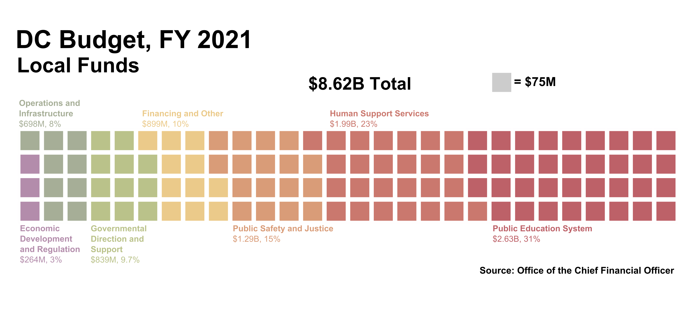

```{r setup, include=FALSE}
knitr::opts_chunk$set(echo = TRUE, warning = FALSE, message = FALSE)
library(knitr)
library(tidyverse)
library(DT)

budget_table <- read_rds("output/budget_table.rds")
```



Find out what your local taxes are going toward in the District. Use the table below to explore the District of Columbia's local budget. Data supplied by the Office of The Chief Financial officer.  
  
Note that these are *local* funds only - DC also receives Federal dollars. Find out more about the budget plan in its entirety [here](https://cfo.dc.gov/node/289642).

```{r, echo=F}
budget_table %>%
  mutate(pct_change = (fy_2021_approved_budget-fy_2020_approved_budget)/fy_2020_approved_budget) %>%
  select(
    spend_category,
    agency,
    fy_2020_approved_budget,
    fy_2021_approved_budget,
    pct_change
  ) %>%
  arrange(spend_category, desc(fy_2021_approved_budget)) %>%
  datatable(extensions = c('Buttons'), 
            colnames = c('Spending Category', 'Agency', 'FY 2020', 'FY 2021', '% Change'),
            options = list(pageLength = 10, 
                           lengthMenu = list(c(10,50,100,-1), 
                                          c('10', '50', '100','All')),
                           autoWidth = TRUE, 
                           dom = 'Blfrtip', 
                           buttons = list(list(extend = 'csv', text = 'Download', filename =  "DC_Local_Budget_2021" ))), 
            rownames = F, filter = 'top') %>% 
  formatCurrency(c(3, 4)) %>% 
  formatPercentage(5, 2)
```