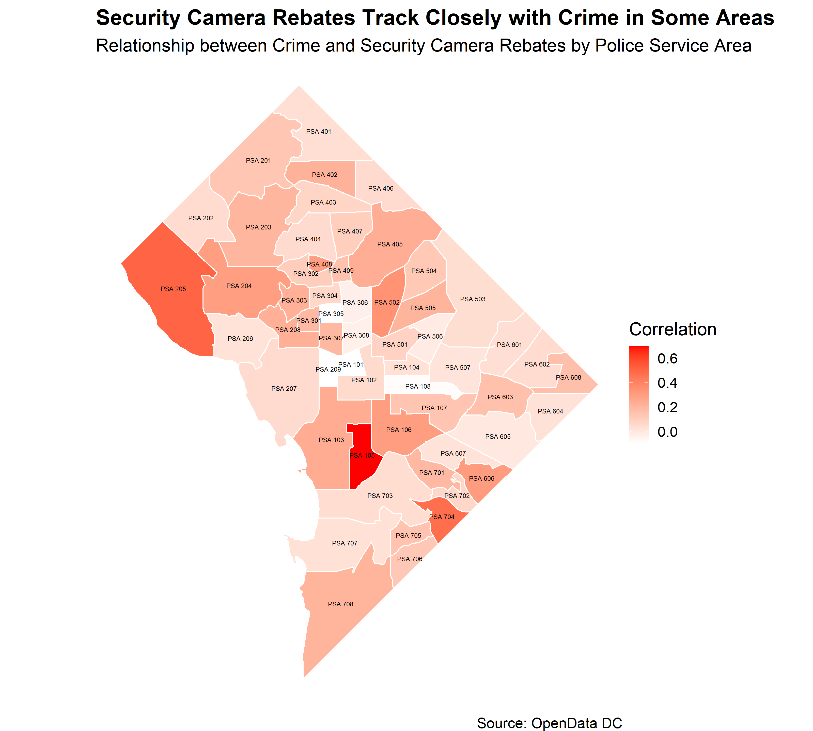
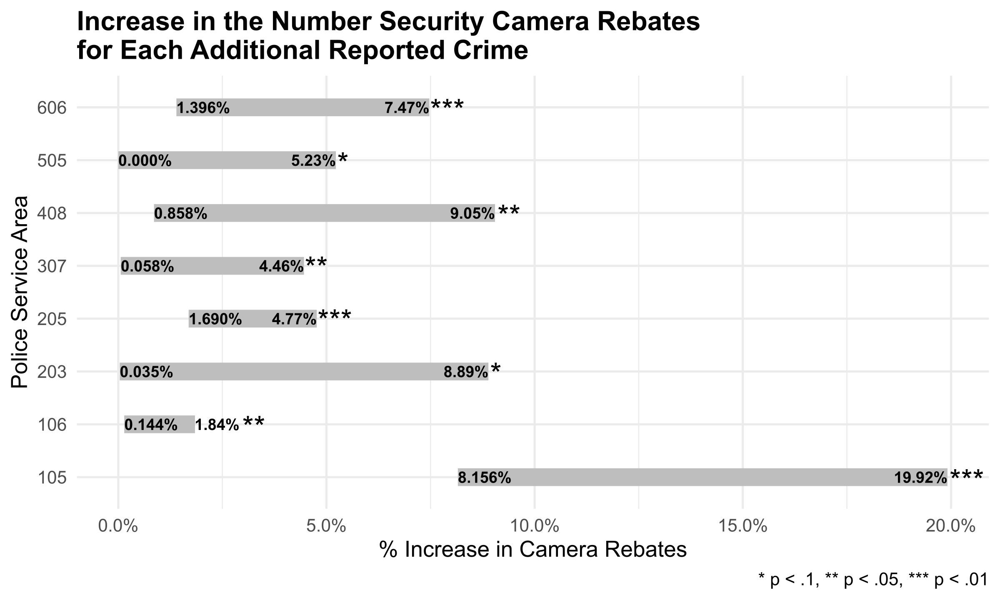

```{r setup, include=FALSE}
knitr::opts_chunk$set(echo = TRUE, warning = FALSE, message = FALSE)
library(knitr)
library(readr)
library(dplyr)
library(ggfortify)
library(ggplot2)

crimes_cameras <- read_csv('output/crimes_cameras.csv')

ccf_df <- crimes_cameras %>%
   group_by(psa) %>%
   group_modify(~stats::ccf(x = .x$cameras, y = .x$crimes, plot = F, lag.max = 3) %>% 
                  ggplot2::fortify()) %>%
  filter(Lag >= 0) %>% # Limit to post-crime lag
  group_by(psa) %>%
  filter(ACF == max(ACF)) # Get strongest correlations by PSA
```

### Are residents more likely to buy security cameras with increases in crimes in their neighborhood? 

[Data](https://opendata.dc.gov/datasets/private-security-camera-rebate-program/data?page=14) from the District's [Private Security Camera Rebate Program](https://ovsjg.dc.gov/page/private-security-camera-rebate-program)[^1], combined with the Metropolitan Police Department's [crime data](https://dcatlas.dcgis.dc.gov/crimecards/) indicate a correlation between camera rebates and crime in certain areas of the District.

[^1]: Many thanks to the helpful folks at the Office of Victim Services and Justice Grants, who provided and helped explain the data.

The map below shows that, in some [Police Service Areas (PSAs)](https://mpdc.dc.gov/page/police-districts-and-police-service-areas), residents were more likely to obtain cameras as a part of the District's rebate program, following increases in crime. Specifically, between 2018 and 2021, some areas saw greater uptake in the camera rebate program following both property and violent crime. 



The correlations obtained in this graph are calculated using the [cross correlation function](https://www.investopedia.com/terms/c/crosscorrelation.asp) between the number of crimes and the number of camera rebates over time, up to 3 months lag in crimes. 

This can be done with the following R code (code and data for this post can be found [here](https://github.com/hersh-gupta/website/tree/master/content/post/2021-02-15-dc-security-cameras-and-crime)):

```{r, eval=F}
library(tidyverse)

# Load crime and camera data
crimes_cameras <- read_csv('output/crimes_cameras.csv')

# Calculate CCF by PSA
ccf_df <- crimes_cameras %>%
   group_by(psa) %>%
   group_modify(~stats::ccf(x = .x$cameras, y = .x$crimes, plot = F, lag.max = 3) %>% 
                  ggplot2::fortify()) %>%
  filter(Lag >= 0) %>% # Limit to post-crime lag
  group_by(psa) %>%
  filter(ACF == max(ACF)) # Get strongest correlations by PSA
```

### How can we measure uptake in the program as a result of crime?

Estimating the effect of crime on applications to the security camera rebate program can be done so using statistical models for each PSA, in which the lagged number of crimes is the singular predictor to monthly security camera rebates:

$$\text{Crime}_{t-lag} \longrightarrow \text{Camera Rebates}_{t_0}$$

After finding little to no autocorrelation (i.e. previous months' camera rebates do not affect current months'), I determined it was appropriate to use a generalized linear model with Poisson distributed errors to model monthly counts of security camera rebates. The predictor in the models is lagged using the lag with the maximum cross correlation function value found above. 

```{r, eval=F}
mod_df <- ccf_df>%
  mutate(df = map(psa, ~district_min %>%
                     filter(psa == .x) %>%
                    # Create lagged data for each PSA
                     mutate(crimes1 = lag(crimes,1),
                            crimes2 = lag(crimes,2),
                            crimes3 = lag(crimes,3))),
         # Specify models using the lag identified with CCF
         formula = map(Lag, ~if(.x == 0) {cameras ~ crimes}
                       else if(.x == 1) {cameras ~ crimes + crimes1}
                       else if(.x == 2) {cameras ~ crimes + crimes1 + crimes2}
                       else if(.x == 3) {cameras ~ crimes + crimes1 + crimes2 + crimes3}
                       else NULL),
         # Fit the models
         fit = map2(df, formula, ~glm(.y, data = .x, family = "poisson", 
                                      na.action = "na.omit", maxit = 100)))
```

In any modeling exercise, it is important to avoid model misspecification. In order to ensure the models are unbiased, I conduct tests for over- and under-dispersion, check for outliers, and ensure that the residual values follow the expected distribution. 

In R, I used the `DHARMa` package to test simulated residuals. The results were used to evaluate model specification and were generated using the following code:

```{r, eval=F}
library(DHARMa)

mod_df %>%
  mutate(res_test = map(res, ~DHARMa::testResiduals(.x, plot = F)),
         unif_test = map(res_test, ~.x$uniformity$p.value),
         disp_test = map(res_test, ~.x$dispersion$p.value),
         out_test = map(res_test, ~.x$outliers$p.value))
```

Of the 55 models built for each PSA, 29 ended up misspecified. This was due to zero-inflation of security camera rebate counts and overdispersion of residuals. 

However, the remaining 26 models were not misspecified. Of these 26 models, only eight had significant coefficient values. In the following PSAs, the models were both fit well and provided significant estimates: 105, 106, 203, 205, 307, 408, 505, 606. 


The above graph uses lagged predictors of crime, and, as such, should be interpreted as follows:

* For each additional reported crime, the number of security camera rebates in PSA 105 will increase by 8% to 20% within one month. 
* For each additional reported crime, the number of security camera rebates in PSA 106 will increase by 0.1% to 2% within the same month. 
* For each additional reported crime, the number of security camera rebates in PSA 203 will increase by 0.4% to 9% within one month. 
* For each additional reported crime, the number of security camera rebates in PSA 205 will increase by 2% to 5% within one month. 
* For each additional reported crime, the number of security camera rebates in PSA 307 will increase by 0.5% to 4% within two months. 
* For each additional reported crime, the number of security camera rebates in PSA 408 will increase by 1% to 9% within the same month. 
* For each additional reported crime, the number of security camera rebates in PSA 505 will increase by 0% to 5% within two months. 
* For each additional reported crime, the number of security camera rebates in PSA 606 will increase by 1% to 7% within the same month. 

### Why is this important? 

Estimating public responsiveness to purchasing private security cameras due to reported criminal activity may have significant implications for the program. If there are areas which are less likely to participate in the program relative to their neighbors, but have similar increases in crime, it may signal an opportunity for representatives of the Office of Victim Services and Justice Grants (OVSJG), who administer the program, to work with the Metropolitan Police Department (MPD) to promote the program in those areas. 

Additionally, these models may be used to forecast program budgets. Given current crime rates, program officials may be able to estimate the number of rebates to be administered in the following weeks and months. This could be particularly useful in obtaining estimates of costs to the program. 

