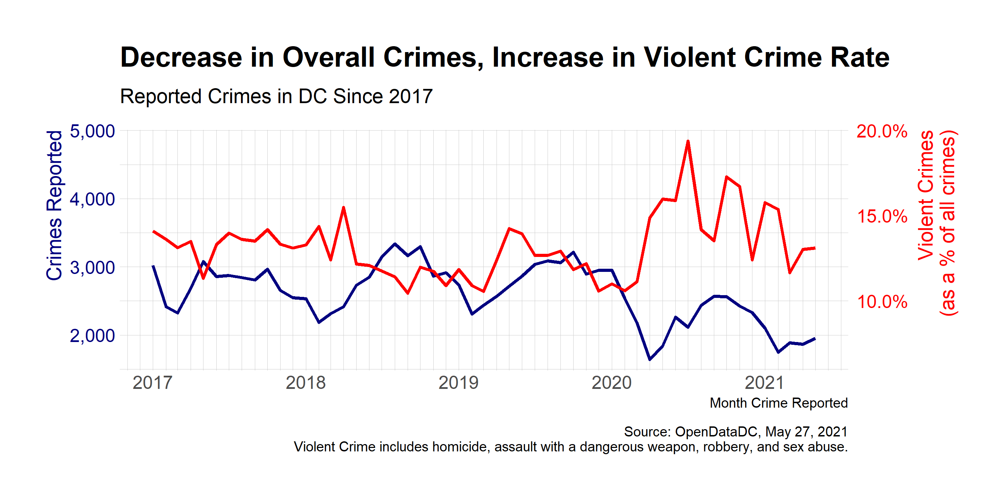
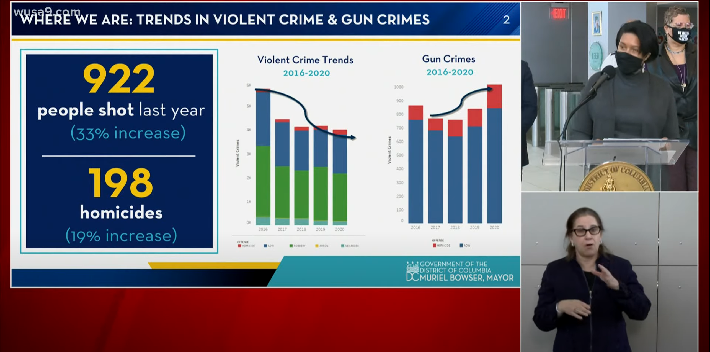
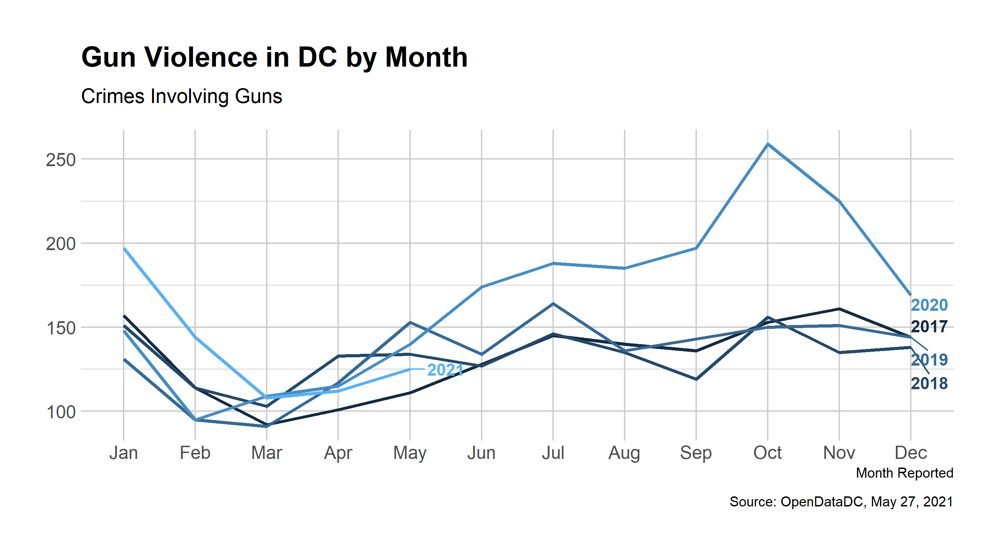
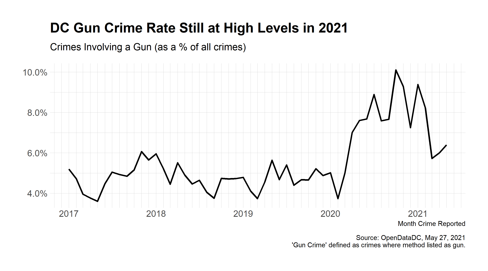

In the last few months, there has been an increase in violent crime in DC. This lead Mayor Bowser to set up a gun violence [emergency operations center](https://www.wusa9.com/article/news/crime/building-blocks-dc-gun-violence-prevention-program-dc/65-9eb46a67-f504-42f7-bb37-3d3837c82426) and declare gun violence a public health emergency. In a press conference, Mayor Bowser presented the following data: 

The two graphs in the slide from Mayor Bowser's presser show a decrease in violent crimes while also showing an increase in gun crime. **This, however, may be misleading.** In particular, what the graph on the left does not show is that while there is an overall decrease in crime, the violent crime rate is actually increasing.

Using data from the Metropolitan Police Department (MPD) via the OpenData DC portal, I downloaded crime data from the last five years, 2017 to May 2020. My analysis found that there was a decrease in the number of crimes reported since 2017. However, **the rate of violent crimes has been increasing** since early 2020, around the start of the pandemic. 

The rise in violent crime has particuarly centered around the increase in gun-related violence. Gun violence increases every year, usually in the spring and summer months. The chart below shows that gun crimes in 2021 are following this seasonal trend. 

However, the number of crimes involving guns has trended higher in the first few months of 2021 than in the same time period in any of the other years. Furthermore, the percentage of crimes in which a gun was involved has stayed at record levels. 

Mayor Bowser's plan to use a "data-driven" approach is laudable. However, the approach needs to be transparent with the information being collecting and the methodology behind what's being published. 

Code for this analysis available on [Github](https://github.com/hersh-gupta/dc-violent-crime).

