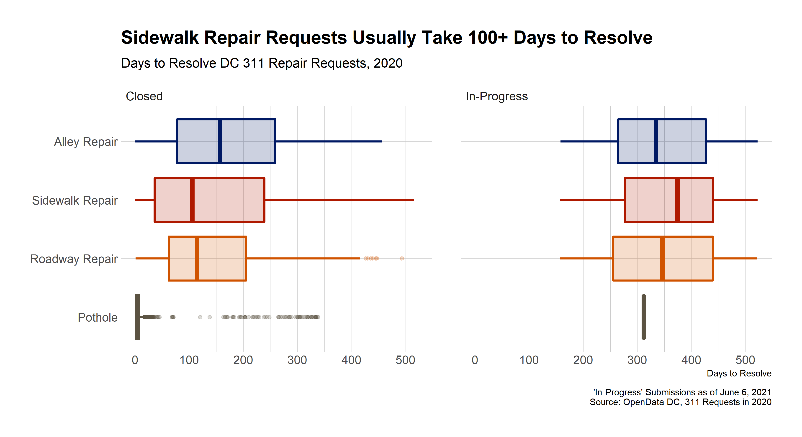
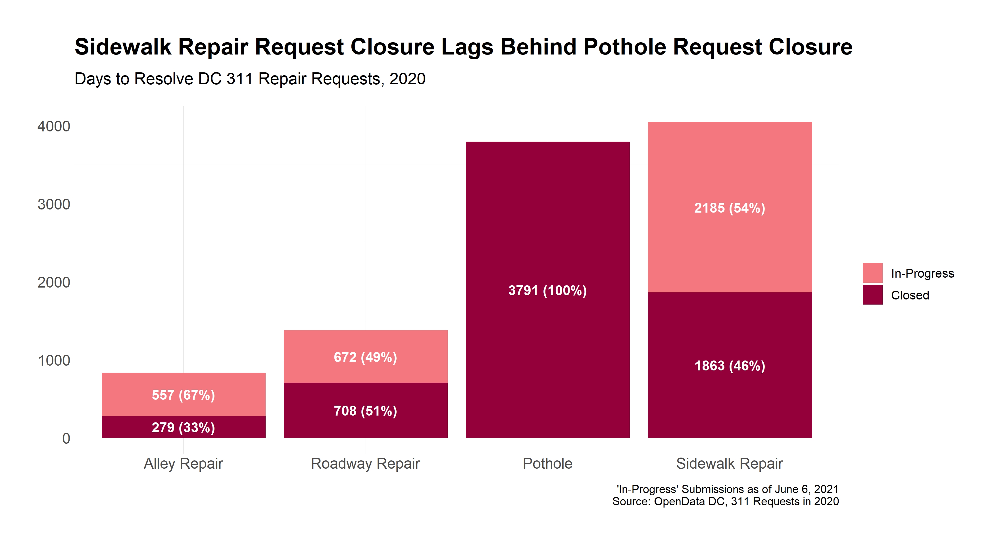

```{r setup, include=FALSE}
knitr::opts_chunk$set(echo = TRUE, warning = FALSE, message = FALSE)
library(knitr)
library(tidyverse)

repair_requests_2020_cl <- read_rds("output/repair_requests_2020_cl.rds")
```



The DC's [311 City Service portal](https://311.dc.gov/citizen/home) allows District residents and visitors to submit requests for government services. DC then provides data for all 311 requests publicly via its [OpenData Portal](https://opendata.dc.gov/datasets/82b33f4833284e07997da71d1ca7b1ba_11). Using this data, I can summarize how long it takes DC's Department of Transportation (DDOT) to respond to repair requests. 

Specifically, I look at how long it takes DDOT to respond to **alleyway repairs**, **roadway repairs**, **potholes**, and **sidewalk repairs** using data from 2020. DDOT defines each of these types of repairs in more detail [here](https://ddot.dc.gov/page/request-repairs). 

Among other fields, the data includes the following:

* **Service Description**: the type of service requested
* **Service Request Date**: the date the request was ordered
* **Service Status**: whether the request has been completed (closed) or is open (in-progress)
* **Service Resolution Date**: the date the request was completed

First, I summarize the number and percentage of each type of request and whether it was closed. The graph below shows that, **of the sidewalk repair requests made in 2020, less than half were designated closed as of the date this post was written**. Compare this to 100% of all pothole requests in 2020 having been closed. Note that the [process of sidewalk repair](https://ddot.dc.gov/service/sidewalk-repair) requires an investigation, and, in the absence of findings, requests are seemingly marked as "In-Progress" indefinitely.



So how long do sidewalk repair requests take to complete? When looking at the data from 2020, we see that, of the requests that were completed, **more than half of them took over 100 days to complete. A quarter of these requests took even longer -- more than 250 days to be permanently resolved.** 


According to their [website](https://ddot.dc.gov/service/sidewalk-repair), "DDOT's standard is to resolve sidewalk repair requests within 25 business days of the time they are reported." For pothole repair this time is stated as only three days. 

<style>
  table {
    display: inline-table;
  }
</style>

```{r, echo=F}
repair_requests_2020_cl %>%
  filter(SERVICEORDERSTATUS %in% c("Closed")) %>% 
  group_by(SERVICECODEDESCRIPTION) %>% 
  summarize(med = median(days_to_resolve),
            avg = mean(days_to_resolve) %>% round(0),
            count = n()) %>%
  kable(col.names = c("Service", "Median", "Average", "Count"), caption = "Service Request Closure Time (in days), as of June 6, 2021")

```

Table 1 shows a majority of pothole requests are meeting DDOT's standard of 72 hours to close. However, **most sidewalk repair requests have taken over four times longer than the 25 days DDOT has allotted.**

The discrepancies shown here are the reason why citizen initiatives such as the recent [Sidewalk Palooza](https://ggwash.org/view/81555/dc-residents-create-sidewalk-palooza-for-pedestrian-safety) are organized. With greater awareness and analysis of these infrastructure problems, perhaps DDOT can take further steps to address them. 

Code for this analysis available on [Github](https://github.com/hersh-gupta/dc-sidewalk-repair).

